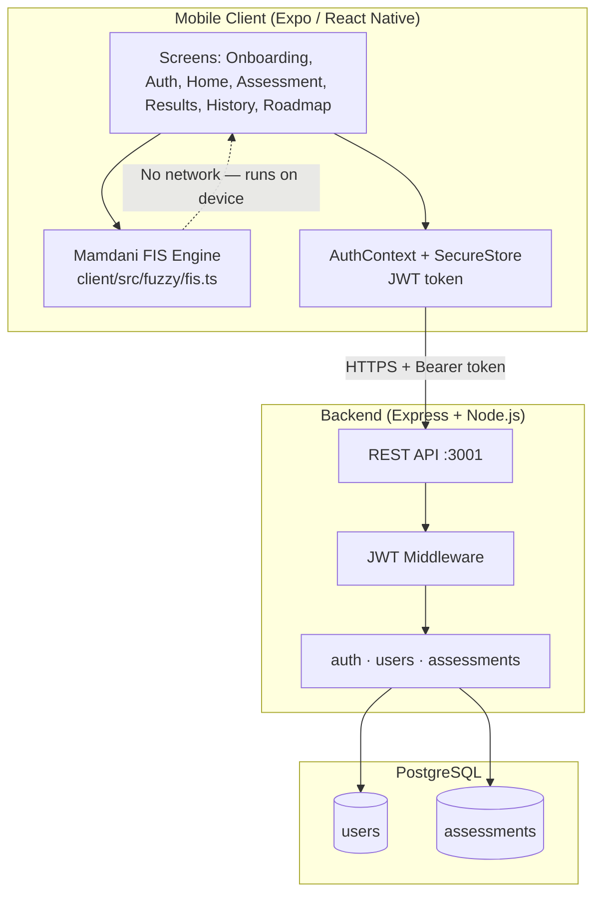
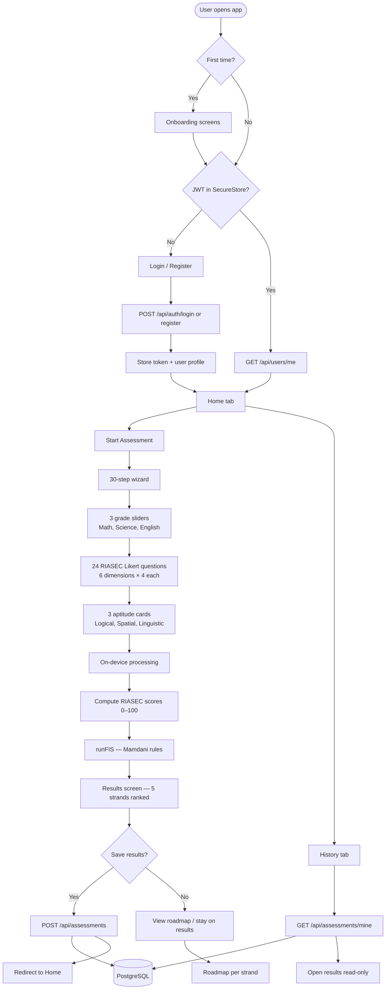
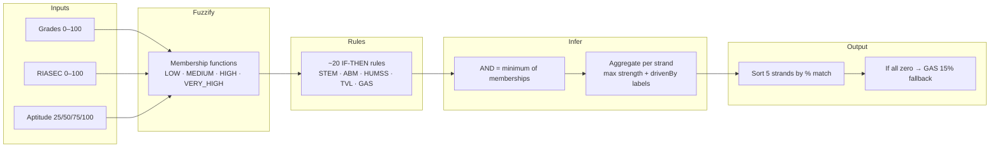
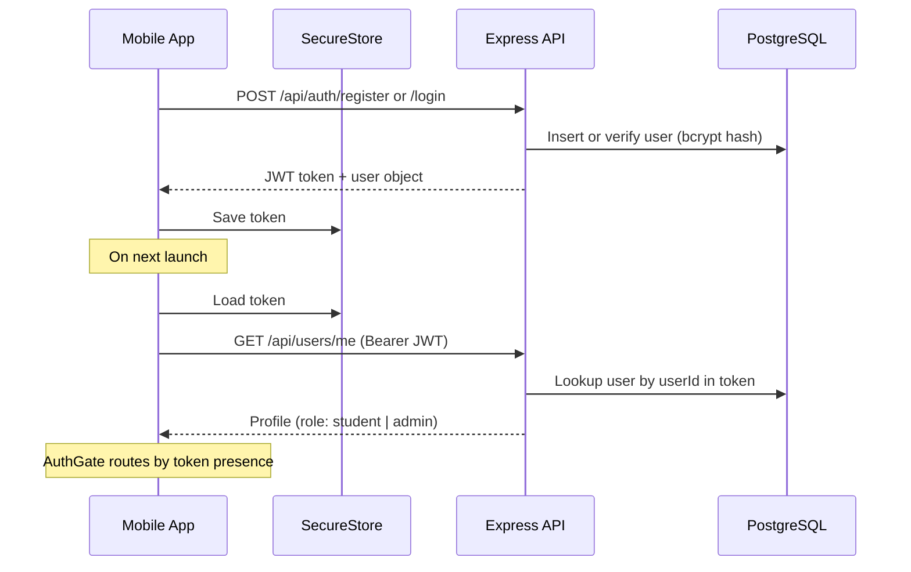

# CareerTrack
## Academic Strand Recommendation System

**How the system works**

Fuzzy Inference System (FIS) · RIASEC · On-device AI · PostgreSQL backend

---

## What Problem Does It Solve?

Senior high students must choose an academic strand (STEM, ABM, HUMSS, TVL, GAS) with limited guidance.

**CareerTrack helps by:**
- Collecting grades, interests (RIASEC), and aptitude in one guided flow
- Ranking all five strands with a **degree of match** (%)
- Explaining **why** each strand scored high (“driven by” factors)
- Saving history so students and admins can review past results

> Decision-support tool — students should still consult school guidance counselors.

---

## High-Level Architecture



**Key design choice:** Fuzzy logic runs **entirely on the phone**. The server only stores accounts and saved results.

---

## Technology Stack

| Layer | Technology | Role |
|-------|------------|------|
| **Client** | React Native, Expo Router | Cross-platform mobile UI |
| **Inference** | TypeScript FIS (Mamdani) | Strand ranking on-device |
| **Auth storage** | expo-secure-store | Persist JWT securely |
| **Server** | Express, TypeScript | REST API |
| **Database** | PostgreSQL + JSONB | Users & assessment records |
| **Security** | bcrypt, JWT | Password hashing & API auth |

---

## Main Screens & Navigation

| Screen | Path | Purpose |
|--------|------|---------|
| Onboarding | `/onboarding` | First-time intro (3 pages) |
| Login / Register | `/(auth)/…` | Account access |
| Home | `/(tabs)/home` | Start assessment, quick links |
| Assessment | `/assessment` | 30-step wizard |
| Results | `/results` | Ranked strands + save |
| Roadmap | `/roadmap` | Per-strand career path detail |
| History | `/(tabs)/history` | Past saved assessments |
| Resources | `/(tabs)/resources` | Curated links |
| Admin | `/(tabs)/admin` | All users & assessments (admin only) |

**AuthGate** (`_layout.tsx`) redirects unauthenticated users to login and signed-in users away from auth screens.

---

## End-to-End System Flow



---

## Assessment Wizard (30 Steps)

| Phase | Steps | Input type | Stored as |
|-------|-------|------------|-----------|
| **Grades** | 3 | Slider 60–100 | `grades.math`, `.science`, `.english` |
| **RIASEC** | 24 | Likert 1–5 (emoji cards) | Raw answers per dimension |
| **Aptitude** | 3 | Low / Medium / High / Very High | 25, 50, 75, or 100 |

Progress bar and back navigation are supported; exiting mid-assessment warns that progress is lost.

---

## RIASEC Scoring

Each of the **6 Holland dimensions** has 4 questions:

- Realistic, Investigative, Artistic, Social, Enterprising, Conventional

**Formula:** average of 4 answers (1–5) × 20 → **score 0–100** per dimension

```text
Example: answers [4, 5, 4, 5] → avg 4.5 → score 90
```

These scores feed the fuzzy engine together with grades and aptitude.

---

## Fuzzy Inference System (FIS)

**Type:** Mamdani-style, **fully deterministic**, **no ML model**



**Example STEM rules (simplified):**
- IF Math is High AND Science is High → activate STEM
- IF Math is Very High AND Logical aptitude is Very High → activate STEM

Each strand accumulates the **strongest** rule activation; result is **degree of match** (0–100%, one decimal).

---

## Results Screen

After `runFIS()`:

1. **Best match banner** — top strand with icon and %
2. **Disclaimer** — consult guidance counselor
3. **Ranked cards** — all 5 strands with progress bars and “driven by” chips
4. **Roadmap** — tap a strand → `/roadmap` with career path info
5. **Save** — `POST /api/assessments` then redirect to `/(tabs)/home`

Saved payload includes: `grades`, `riasec_scores`, `aptitude_ratings`, `recommendations` (full FIS output JSON).

---

## Authentication Flow



- JWT expires in **30 days**
- Admin role set manually in DB: `UPDATE users SET role = 'admin' …`

---

## API & Database (Server Responsibilities)

| Method | Endpoint | Who | What |
|--------|----------|-----|------|
| POST | `/api/auth/register` | Public | Create account |
| POST | `/api/auth/login` | Public | Issue JWT |
| GET | `/api/users/me` | User | Current profile |
| GET | `/api/users` | Admin | List all users |
| PATCH | `/api/users/:id/role` | Admin | Promote/demote |
| POST | `/api/assessments` | User | Save one result |
| GET | `/api/assessments/mine` | User | Own history |
| GET | `/api/assessments` | Admin | All assessments |
| DELETE | `/api/assessments/:id` | User | Delete own record |

**Tables:** `users` (credentials, role) · `assessments` (JSONB blobs per attempt)

---

## What Runs Where?

| Action | Where | Network? |
|--------|-------|----------|
| Answer questions | Client | No |
| RIASEC score math | Client | No |
| Fuzzy rules & ranking | Client | No |
| Login / register | Client → Server | Yes |
| Save / load history | Client → Server | Yes |
| Admin dashboards | Client → Server | Yes |

**Privacy benefit:** Raw answers and FIS computation never need to leave the device unless the user taps **Save Results**.

---

## Five Academic Strands (Output)

| Strand | Focus |
|--------|--------|
| **STEM** | Science, technology, engineering, mathematics |
| **ABM** | Accountancy, business, management |
| **HUMSS** | Humanities and social sciences |
| **TVL** | Technical-vocational-livelihood |
| **GAS** | General academic — keeps college options open |

The engine always returns **all five**, sorted highest to lowest match.

---

## Admin Features

Users with `role = 'admin'` see an extra tab:

- View all registered users
- View all assessments across students
- Change user roles (student ↔ admin)

Students only see their own history and cannot access global lists.

---

## Summary

1. **Guided assessment** captures grades, RIASEC interests, and aptitude (30 steps).
2. **On-device Mamdani FIS** ranks STEM, ABM, HUMSS, TVL, GAS with explainable “driven by” factors.
3. **Optional cloud save** stores results in PostgreSQL for history and admin oversight.
4. **JWT auth** secures API access; fuzzy logic stays local for speed and privacy.

**CareerTrack** = decision support, not a replacement for human guidance.

---

## Appendix — Project Layout

```text
fuzz/
├── client/          Expo app (UI + FIS)
│   └── src/fuzzy/fis.ts
└── server/          Express API + schema.sql
```

**To present this deck:** open in VS Code with the [Marp for VS Code](https://marketplace.visualstudio.com/items?itemName=marp-team.marp-vscode) extension, then export to PDF or PowerPoint.
